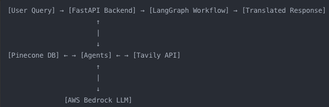
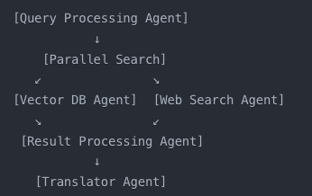
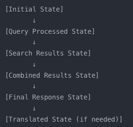
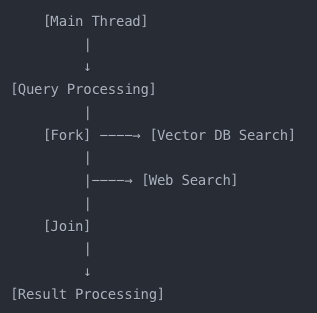
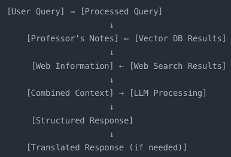

# Run

docker build -t ta_app .
docker run --rm -p 8000:8000 --add-host=host.docker.internal:host-gateway --entrypoint python --env-file .env ta_app main.py

# teaching-assistant

A RAG (Retrieval-Augmented Generation) application using Pinecone for vector storage and Tavily for web search

# TO-DO:

change context for lab

# Pinecone vector DB

- Subject Indexing:
  -- Research Lab: Demonstrates the system's ability to handle specialized knowledge

# Potential:

TranslationAgent: Translates the content to different languages.
Ask user to choose from a template, one is MCQ, one is mixed, one is professor and internet answer with customised fonts.
make the project to use cognito, and have each user limit of 15 or something.
say in development stage and less queries right now
store user queries and show
Learn more (having the sources)
flashcards?

# Project Enhancements:

Create a user interface for easy interaction with the multi-agent system
Implement a feedback loop where the system learns from user interactions
Add a feature to update the Pinecone index with new information from Tavily searches

# End Product:

ImageGenerationAgent: Creates relevant images for the content.
SummaryAgent: Provides a concise summary of the information.
FactCheckAgent: Verifies the accuracy of the information.

# Hurdles:

Installing dotenv had issues so downloaded python-dotenv

#Ideas:
Research Assistant?

# UI Ideas:

Combined View
Side-by-Side Comparison
Tabbed Interface
Interactive Mind Map:

# Project

Project Definition: An Advanced Teaching Assistant System with Personalized Knowledge Base and Web-Enhanced Responses
Overview:
This project involves the development of an advanced teaching assistant system that combines a professor's unique knowledge base with real-time web search capabilities. The system is designed to provide students with comprehensive, accurate, and personalized responses to their queries in the field of "History of Technology and Innovation."
Key Components:

Personalized Knowledge Base:

It contains a professor's unique notes, perspectives, and insights on the history of technology and innovation.
These notes are characterized by the professor's personal "signature" - their unique viewpoints, anecdotes, and specific focus areas within the broader subject.
The knowledge base is stored in a Pinecone vector database for efficient retrieval.

Web Search Integration:

It utilizes the Tavily API to perform real-time web searches.
The system supplements the professor's notes with up-to-date information, detailed explanations, and broader context from the internet.

Query Processing:

The system employs natural language processing to understand and interpret student queries.
It matches queries against the personalized knowledge base and determines when additional web search is necessary.

Response Generation:

The assistant combines information from the professor's notes and web search results.
It crafts coherent, informative responses that blend the professor's unique insights with comprehensive web-sourced information.

AWS Infrastructure:

The project leverages AWS CDK for infrastructure as code, ensuring scalable and maintainable cloud architecture.
It utilizes AWS Lambda for serverless compute, handling query processing and response generation.
The system employs DynamoDB for storing query history and processed file information.
It uses S3 for storing any necessary static assets or large data files.

Multi-Agent System:

The project implements a system of specialized AI agents, each handling specific tasks in the query-response pipeline.
Agents include: query understanding, knowledge base retrieval, web search, information synthesis, and response generation.

User Interface:

It provides a simple, intuitive interface for students to submit queries and receive responses.
The interface may include features for saving or categorizing responses for future reference.

Project Goals:

To enhance student learning by providing access to both professor-specific knowledge and broader web-sourced information.
To demonstrate the effective integration of personalized knowledge bases with real-time web search capabilities.
To showcase the power of multi-agent AI systems in educational technology.
To provide a scalable, cloud-based solution that can be adapted to various subjects and educational contexts.

Unique Value Proposition:
This teaching assistant goes beyond traditional Q&A systems by offering a blend of curated, professor-specific insights and comprehensive web-sourced information. It preserves the unique value of a professor's perspective while ensuring students have access to the most current and detailed information available.

## More about project

Project Summary: Multi-Agent Educational Query System
Overview:
This project is a sophisticated multi-agent system designed to provide comprehensive answers to educational queries. It combines information from a professor's notes (stored in a vector database) with up-to-date web search results. The system processes queries, performs parallel searches, synthesizes information, and can translate responses to different languages.
Key Components:

FastAPI Backend: Handles HTTP requests and manages the overall workflow.
LangGraph: Orchestrates the multi-agent workflow.
Pinecone: Vector database for storing and querying professor's notes.
Tavily: Web search API for retrieving current information.
AWS Bedrock: Large Language Model (LLM) for generating responses.
Deep Translator: For translating responses to different languages.

Technical Details:

Agent Structure:

Query Processing Agent: Prepares the user's query for processing.
Vector DB Agent: Queries the Pinecone database for relevant professor's notes.
Web Search Agent: Performs a web search using Tavily API.
Result Processing Agent: Synthesizes information and generates a response using AWS Bedrock.
Translator Agent: Translates the final response if needed.

Workflow:

The system uses LangGraph to create a directed graph of agent interactions.
Parallel execution is implemented for Vector DB and Web Search agents.

State Management:

A shared AgentState object is passed between agents, containing all necessary information.

Asynchronous Operations:

Utilizes Python's asyncio for concurrent operations, especially in parallel searches.

Error Handling and Logging:

Comprehensive error handling and logging are implemented throughout the system.

Translation:

Uses Deep Translator for robust translation capabilities.

Configuration:

Utilizes environment variables and configuration files for flexible deployment.

Diagrams:

