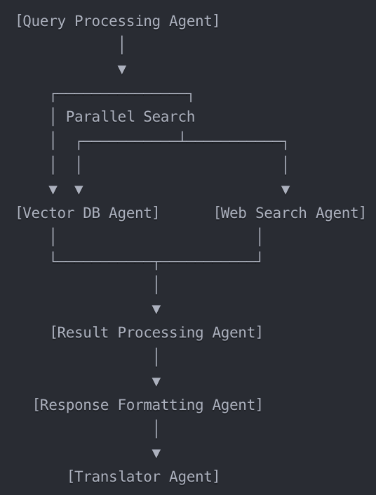

# AI-Enhanced Teaching Assistant

## Project Live Link

[Click here to view the live project](https://teachingassistant-dv.streamlit.app/)

## Project Overview and Goals

This project implements an advanced AI-powered teaching assistant that combines knowledge from multiple professors with real-time web information to provide comprehensive, accurate, and personalized responses to student queries. The system leverages a team of AI agents working collaboratively to enhance the learning experience across various subjects and professors.

### Goals

1. Integrate knowledge from multiple professors with up-to-date web information.
2. Provide personalized and comprehensive responses to student queries.
3. Enhance student learning through interactive and adaptive content presentation.
4. Demonstrate the effective use of LangGraph and Tavily API in a multi-agent system.

## Key Features

- **Multi-Professor Support:** Students can select from multiple professors, accessing specialized knowledge bases for each.
- **Web-Enhanced Responses:** Combines professor-specific knowledge with current web information for comprehensive answers.
- **Personalized Learning:** Tailors responses based on the selected professor and student preferences.
- **Multi-source Integration:** Merges professors' notes and web information seamlessly.
- **Intelligent Query Processing:** Utilizes embeddings and language models for accurate understanding.
- **Interactive Learning Formats:** Supports MCQs, case studies, and various presentation styles.
- **Multi-language Support:** Includes dynamic translation for global accessibility.

## Architecture

The project uses a multi-agent system architecture:

1. **Query Processing Agent:** Prepares and reformulates the user's query.
2. **Vector DB Agent:** Searches the Pinecone database for relevant notes from the selected professor.
3. **Web Search Agent:** Performs web searches using the Tavily API to supplement professor knowledge.
4. **Result Processing Agent:** Synthesizes information from vector DB and web search.
5. **Response Formatting Agent:** Structures the response in a consistent format.
6. **Translator Agent:** Handles translation of the final response if needed.

The workflow of these agents is orchestrated using the LangGraph framework.


## Technologies Used

- **FastAPI:** Web framework for backend API.
- **Pinecone:** Vector storage for efficient retrieval of professor-specific knowledge.
- **Tavily API:** Web search for up-to-date information.
- **LangGraph:** Agent workflow orchestration.
- **Amazon Bedrock:** Language model inference.
- **AWS Services:** S3, Lambda, DynamoDB for cloud infrastructure.
- **PyPDF2:** PDF processing for professor notes and materials.
- **Streamlit:** User-friendly frontend interface.

## Setup and Installation

1.  Clone the repository:
    ```sh
    git clone https://github.com/yourusername/ai-teaching-assistant.git
    cd ai-teaching-assistant
    ```
2.  Install dependencies:

    ```sh
    pip install -r requirements.txt

    ```

3.  Set up environment variables:
    Create a `.env` file in the root directory and add the following:

    ```PINECONE_API_KEY=your_pinecone_api_key
    TAVILY_API_KEY=your_tavily_api_key
    AWS_ACCESS_KEY_ID=your_aws_access_key
    AWS_SECRET_ACCESS_KEY=your_aws_secret_key
    ```

4.  Initialize the Pinecone index:

    ```sh
    python scripts/initialize_pinecone.py
    ```

5.  Run the FastAPI server:
    ```sh
    uvicorn main:app --reload
    ```
6.  [Run the Streamlit frontend:](https://github.com/DHRUVvkdv/teaching-assistant-frontend)
    ```sh
    streamlit run streamlit_app.py
    ```

## Usage

### API Endpoints

- **POST /combined_query:** Submit a query for processing by the AI teaching assistant.
- **GET /query_status/{query_id}:** Check the status of a submitted query.
- **POST /process_all_pdfs:** Process and index all PDFs for a specific teacher.
- **GET /list_processed_files:** List all processed files for a teacher.

## Example Usage

```python
import requests

API_BASE_URL = "http://your-api-base-url.com"
API_KEY = "your_api_key_here"

# Submit a query
query_data = {
    "query_text": "What is the law of conservation of energy?",
    "teacher_name": "drvinay",
    "target_language": "en"
}
headers = {
    "API-Key": API_KEY,
    "Content-Type": "application/json"
}
response = requests.post(f"{API_BASE_URL}/combined_query", json=query_data, headers=headers)
query_id = response.json()["query_id"]

# Check query status
status_response = requests.get(f"{API_BASE_URL}/query_status/{query_id}", headers=headers)
print(status_response.json())

# Process all PDFs for a teacher
process_data = {"teacher_name": "drvinay"}
process_response = requests.post(f"{API_BASE_URL}/process_all_pdfs", json=process_data, headers=headers)
print(process_response.json())

# List processed files
list_response = requests.get(f"{API_BASE_URL}/list_processed_files?teacher_name=drvinay", headers=headers)
print(list_response.json())
```

## User Interface

The Streamlit-based user interface provides the following features:

- Customizable themes and fonts.
- Dynamic, searchable language selection.
- Options for different presentation styles.
- MCQ generation based on query results.
- Real-time, client-side translation of results.

## Contributing

We welcome contributions to the AI-Enhanced Teaching Assistant project. Please follow these steps to contribute:

1. Fork the repository.
2. Create a new branch:
   ```sh
   git checkout -b feature/AmazingFeature
   ```
3. Make your changes.
4. Commit your changes.
   ```sh
   git commit -m 'Add some AmazingFeature'
   ```
5. Push to the branch:
   ```sh
   git push origin feature/AmazingFeature
   ```
6. Open a Pull Request

## License

This project is licensed under the MIT License - see the [LICENSE.md](LICENSE.md) file for details.

## Acknowledgments

- [Tavily API](https://tavily.com/) for providing powerful web search capabilities.
- [LangGraph](https://github.com/langchain-ai/langgraph) framework for enabling the creation of complex AI agent workflows.
- The open-source community for their invaluable contributions to the tools and libraries used in this project.
